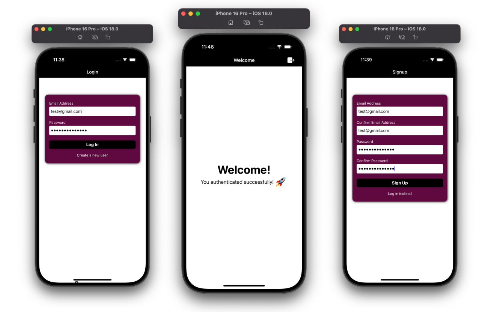

# FIREBASE AUTHENTICATION - UDEMY ASSIGNMENT  🚀 

# Description
This project demonstrates the integration of Firebase Authentication into a React Native application. Built as part of a Udemy course assignment, it includes various authentication features like user sign-up, login, password reset, and more. The app is structured with a clean and modular architecture for scalability and maintainability.

Features
# Firebase Authentication:
- User registration with email and password
- Login with email and password
- Password reset functionality
- User session persistence
# React Native Components:
- Interactive forms for user input
- Dynamic error handling and feedback messages
- State Management:
- Managed using Redux for scalability and efficient state handling.

# Technologies Used
- React Native for building the mobile application
- Firebase for backend authentication
- JavaScript as the primary programming language

##  Screenshots

# Main Packages Used
Below are the primary packages utilized in this project:

- react-native: Framework for building mobile applications.
- firebase: Backend-as-a-Service (BaaS) platform used for authentication.
- react-navigation: Handles in-app navigation with stacks and tabs.
- @react-native-async-storage/async-storage: For storing user session data locally.
- expo : Framework and platform for universal React applications.